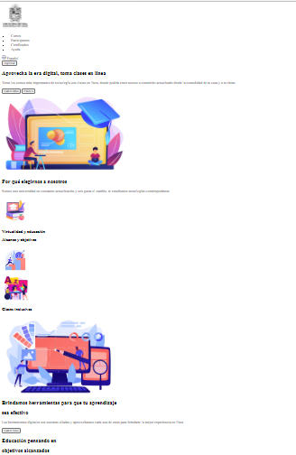

<h1>Taller 9: Juan Sebastian Mosquera</h1>

<h2>Información</h2>

Curso: Full Stack Básico - Grupo 1

Profesor: Cristian Patiño

<h2>Punto 1: Link de Figma</h2>
<a href="https://www.figma.com/file/6fQ7hspu0DVkKkTWozpPzy/Juan-Mosquera---Figma-Excercise-(Copy)?type=design&t=fq8biszIKdYhgb1v-1"target="_blank">Link de Figma</a>

<h2>Punto 1: Pagina Web</h2>
<a href="https://j-s-m-b.github.io/taller-9-full-stack/"target="_blank">Link de Pagina web</a>

<h2>Punto 2: HTML</h2>

<h2>Punto 3: CSS</h2>

<h2>Punto 4: HTML y CSS</h2>

<h2>Punto 5: HTML y CSS</h2>

<h2>Punto 6: HTML y CSS</h2>

<h2>Punto 7-8: HTML y CSS</h2>

<h2>Punto 9: HTML y CSS</h2>
